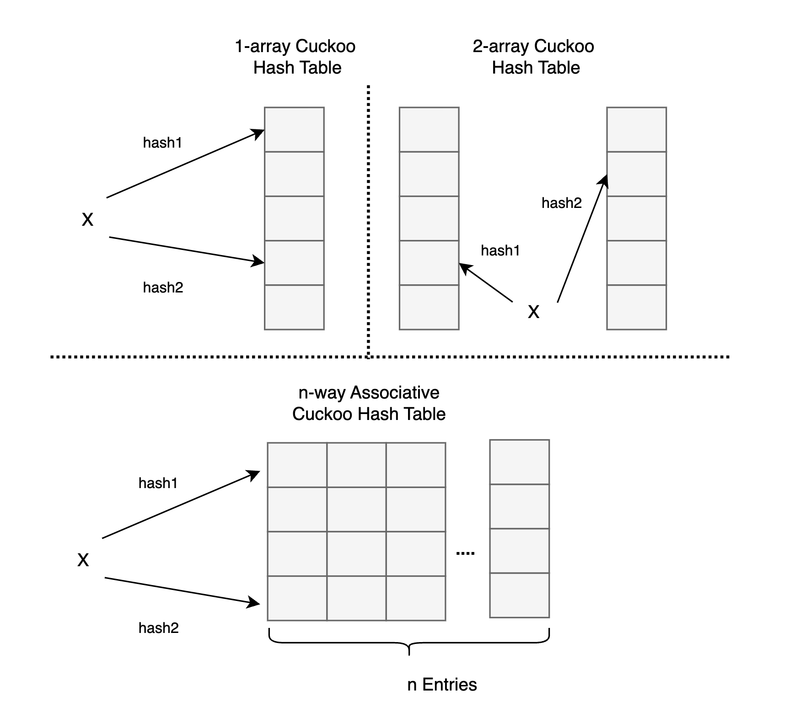
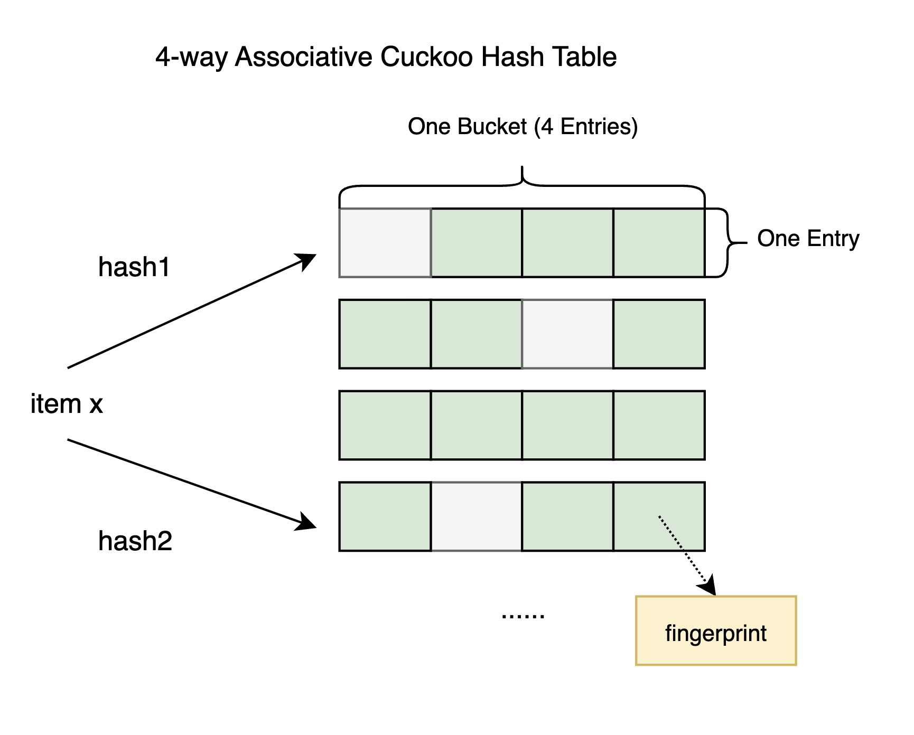
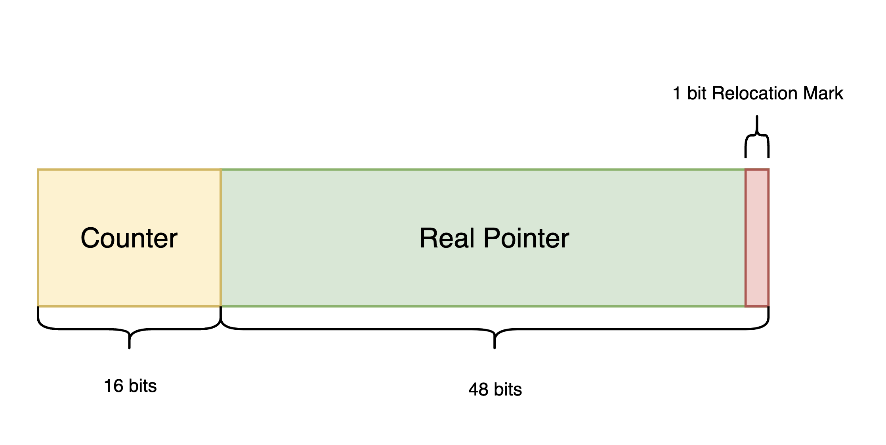
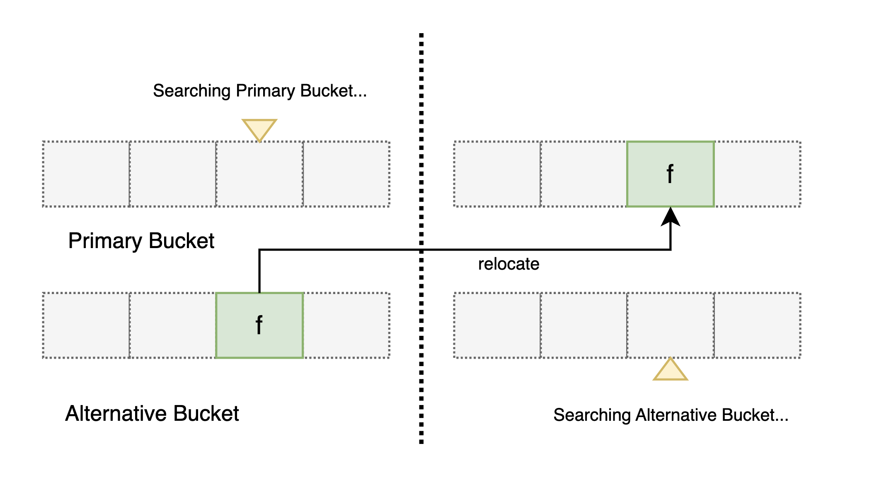
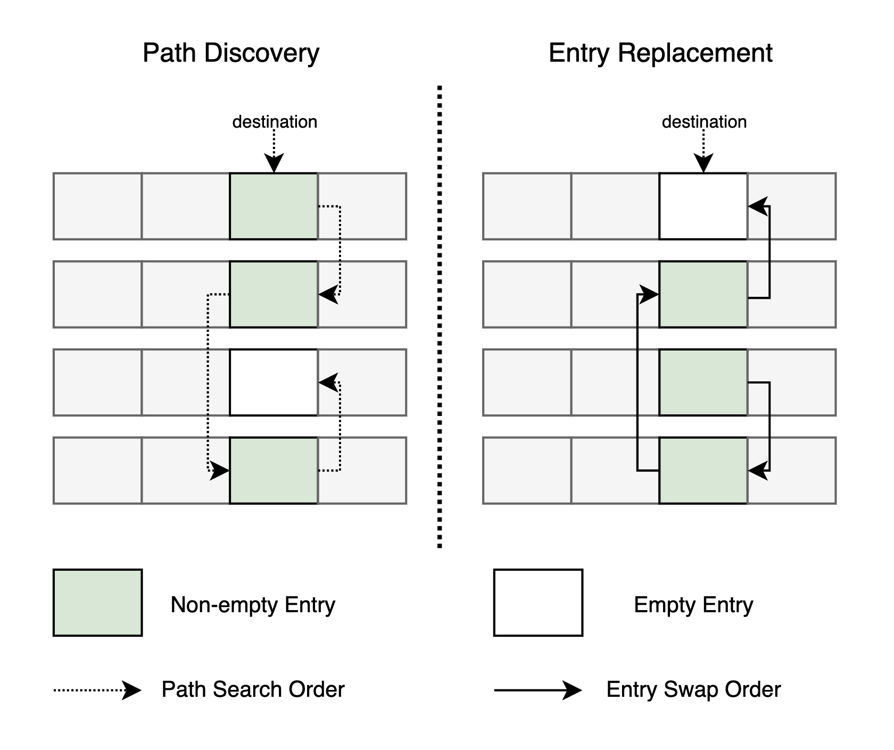
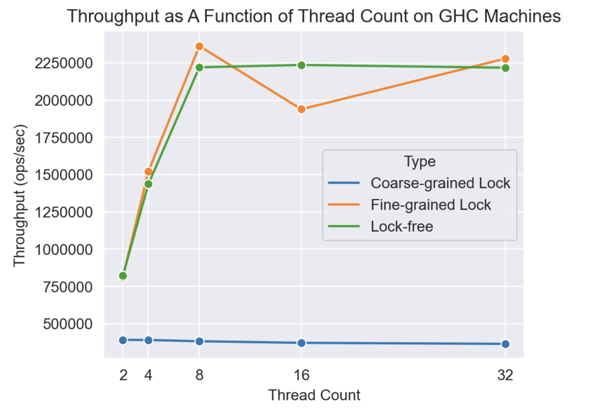
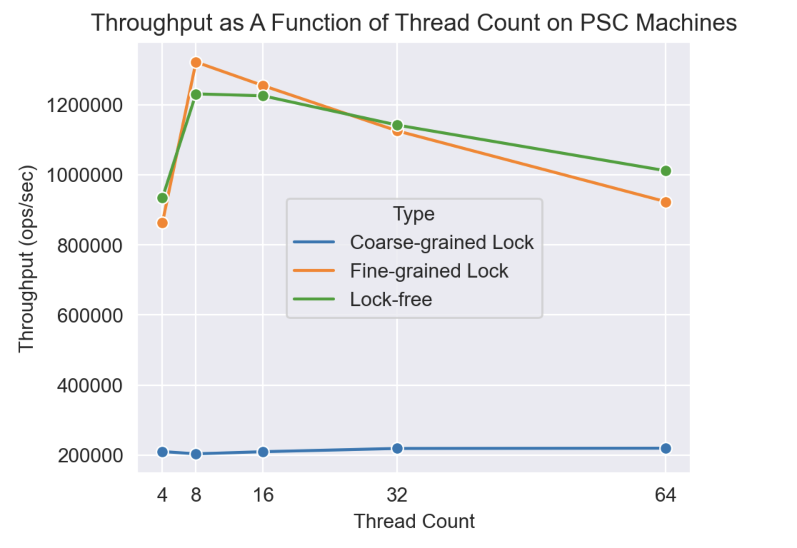
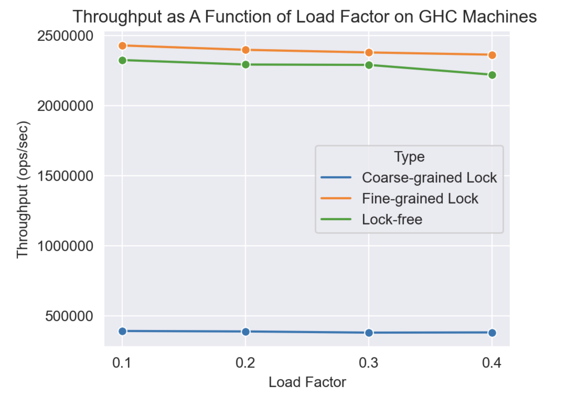

## Lock-free Cuckoo Filter

**Yifei Wang** (yifeiw3)            **Yuchen Wang** (yw7)

### Summary

We implemented an efficient lock-free cuckoo filter in C++. Experiments demonstrate that our filter significantly outperforms its coarse-grained lock counterpart, while reaching throughput comparable to the fine-grained lock version on both GHC and PSC platforms. 

### 1. Background

#### 1.1 Cuckoo Hash Table and Cuckoo Filter

**Cuckoo Hashing**

Cuckoo hashing is a type of open-addressing hash algorithm with $\mathcal{O}(1)$ worst-case look up time. Basically, it uses two hash functions, denoted as $hash_1$ and $hash_2$, to identify two potential locations for a key. If any of these two locations is empty, the key will be inserted there. Otherwise, Cuckoo hashing first kick out one item in one of these two locations (typically the one in $hash_1$), place the new key there, then move the kicked out key to its alternative location. This replacement process continues until an empty entry is reached.

The figure below illustrates the basic cuckoo hash table, denoted as 1-array Cuckoo Hash Table. In addition to this version, two widely used variants exist: the 2-array Cuckoo Hash Table and the n-way associative cuckoo hash table. The former extends the hash table with an additional array, and table entries will be moved between these two arrays during replacement. The latter, often with $n$ set to 4, associates $n$ arrays together. This design allows multiple keys to be associated with the same hash location, effectively reducing the frequency of replacement operations.

**Cuckoo Filter**

Proposed in [1], The cuckoo filter is constructed on top of the 4-way associative cuckoo hash table. Basically, the cuckoo filter is a form of Approximate Membership Query Filter (AMQ-Filter) that determinines whether a specific item exists with a certain false positive rate, which is similar to the Bloom filter. Unlike standard cuckoo hash tables, the cuckoo filter doesn't store the key within the table. Instead, it computes a fingerprint (typically shorter than the key) for each key and stores it in the hash table to reduce memory usage. 

However, due to the absence of the original key, cuckoo filter cannot directly find a finerprint's alternative location during entry replacement. To address this issue, a technique called partial key cuckoo hashing is employed. This method calculates a key's alternative location based on its fingerprint. Specifically, for a key $x$, the calculation proceeds as follows:
$$
h_1(x) = hash(x), \\

h_2(x) = h_1(x) \oplus hash(fprint(x)),
$$
where $hash()$ is a function that maps a string to a integer value, and $fprint()$ calculates $x$'s fingerprint.

The cuckoo filter primarily supports three operations:
1. **find(key)**:  Checks whether a given key exists in the cuckoo filter.
2. **insert(key)**: Inserts a new key into the filter. Unlike a cuckoo hash table, the cuckoo filter supports duplicate keys. If the filter does not have enough capacity, this operation will fail.
3. **remove(key)**: Removes the fingerprint associated with the input key from the filter. It's essential to verify that the key to be deleted actually exists in the filter; otherwise, the filter's behavior is undefined, as this operation might inadvertently remove another key's fingerprint.

#### 1.2 Coarse-grained Lock Cuckoo Filter
The implementation of the coarse-grained lock cuckoo filter is trivial. A single global mutex is used to restrict the access to the cuckoo hash table, meaning that any operations on the cuckoo filter, including *find*, *insert* an *remove*, will be serialized. In our experiments, this filter is used as a baseline for evaluating our fine-grained lock version  and lock-free version's performance.

#### 1.3 Fine-grained Lock Cuckoo Filter

The coarse-grained lock cuckoo filter's performance can be significantly improved by reducing the lock's granularity. A straightforward approach involves associating each hash bucket (i.e., a table line containing 4 entries) with an individual lock. However, this method incurs a considerable space efficiency cost, as the additional space required for storing locks scales linearly with the size of the hash table. In a more efficient design, we opt to create a number of locks equivalent to the number of threads. Specifically, each lock is assigned to control the access to a proportional segment of the hash table, e.g., if there are totally 1280 table lines and 8 locks, each lock is responsible for 160 lines. This adjustment reduces the space cost of locks from $\mathcal{O}(\#table\ lines)$ to $\mathcal{O}(\#threads)$. 

To further mitigate contention between threads, we classify operations into read operations and write operations. Specifically, *insert* and *remove* operations are designated as write operations since they will modify entries. In contrast, the *find* operation is regraded as a read action, as it exclusively queries entries without modification. Based on this analysis, we create two set of locks (reader lock and writer lock) to allow for higher concurrency of read operations. 

With the above locking strategy, we implemented a fine-grained lock cuckoo filter, which exhibits significantly higher throughput compared to the coarse-grained version. In our experiments, this filter serves as a benchmark to evaluate the performance of our lock-free implementation.

### 2. Lock-free Cuckoo Filter

#### 2.1 Data Structures
This subsection describes data structures used in our lock-free cuckoo filter implementation.

**4-way Associative Cuckoo Hash Table**
Basically, our cuckoo hash table structure is fairly similar to the one used in cuckoo filter's original paper [1] with several modifications, as shown below.

For each item to be inserted into the hash table, two hash functions will be used to map it to two distinct buckets, namely the primary and the alternative bucket. Instead of directly storing fingerprints inside the hash table, each fingerprint is put in a piece of dynamically allocated memory. Subsequently, we store an augmented 64-bit pointer (elaborated in the subsequent subsection) in the corresponding table entry, pointing to the allocated memory. The primary rationale behind this adjustment is that atomic compare-and-swap operation cannot be performed on a C++ string instance, while GCC provides `__sync_bool_compare_and_swap` intrinsic to update a 64-bit variable, by which we could modifiy table entries in a lock-free manner.

**Table Pointer**
The construction of the table pointer, essentially a conventional x86_64 pointer augmented with additional information, closely follows the approach outlined in paper [2]. Its structural details are illustrated in the figure below.

The fundamental concept underlying this data structure involves leveraging unused fields within a 64-bit pointer to incorporate additional information. Specifically, the 48-bit real pointer field encompasses the lower 48 bits of a real x86_64 pointer. On the x86_64 platform, only the lower 48 bits of a 64-bit pointer are used to represent valid pointers, with the remaining bits set to zero. Consequently, we can utilize these lower 48 bits to store a pointer indicating the fingerprint, while the higher 16 bits serve to track the number of times this entry has been relocated. This relocation counter is crucial for preventing false misses in *find* operations. Moreover, due to memory address alignment, the least significant bit of an x86_64 pointer will always be zero. We leverage this bit to store a flag, which indicates whether the pointer is currently being relocated.

#### 2.2 Find, Insert and Remove Operations

**Find Operation**

Locating a matching fingerprint in the hash table involves a sequence of queries on potential hash table entries. In our 4-way associative cuckoo hash table, a total of 8 entries must be examined for each input key. Upon finding a matching fingerprint, the find operation returns the location of the entry.

However, this approach may overlook existing fingerprints if they are replaced during the search, leading to false misses. For instance, a matching fingerprint might be stored in its alternative bucket while the *find* operation is querying the primary bucket. By the time the find operation proceeds to search the alternative bucket, the fingerprint may have been relocated to its primary bucket. In such cases, the find operation fails to locate the fingerprint, even if it exists in the hash table, as illustrated in the figure below.

To tackle this issue, we introduce a replacement rule: each fingerprint can only be replaced to the same entry in other buckets. For example, in the above figure, the fingerprint (more precisly, a table pointer pointing to it) stored in the 3rd entry of the alternative bucket can only be relocated to the 3rd entry in its primary bucket. Consequently, each entry now has only two possible locations, regardless of the number of replacements happened. We employ a two-round query approach to find fingerprints while mitigating false misses. This process utilizes each entry's counter value, which records how many times the current entry has been relocated. It is important to note that for simplicity, we omit discussions on hazard pointer-related functionalities, which will be elaborated in detail in section 2.4.

In the first round of the query, besides performing the same operations as in the naive query method, we also record each entry's counter value. In the second round, we iterate through all entry pairs (i.e., two entries in the primary and alternative buckets at the same location) and compare their current counter value with their previously recorded value in the first round (using the `check_counter` function). If more than two relocations occurred during the search, there is a possibility that the search missed an existing value, hence the *find* operation is restarted. Otherwise, we can confirm that the key does not exist.

**Insert Operation**

The *insert* operation in a lock-free environment closely mirrors its counterpart in the sequential cuckoo filter. Initially, we calculate the locations of the primary and alternative buckets and store the fingerprint in dynamically allocated memory. Subsequently, we execute the following operations within an infinite loop:

1. Attempt to find an empty entry among the 8 possible entries in two buckets.
2. If an empty entry is found, and the Compare-and-Swap (CAS) operation to store the new table pointer succeeds, the *insert* operation returns `true`.
3. If no empty entry is found, we invoke the *relocate* operation on all entries in the primary bucket until an empty entry is created. This relocation is carried out in a random order: we generate an array [0, 1, 2, 3], shuffle it randomly, and use it as the order for evicting entries. This technique ensures the equitable distribution of newly inserted keys among all table entries, fostering better load balance.
4. If at least one *relocate* operation succeeds, the *insert* operation is initiated again. Conversely, if no *relocate* operation succeeds, which signifies insufficient capacity in the hash table, the *insert* operation fails. Due to the inherent characteristic of cuckoo filters, which do not retain original keys, rehashing is not feasible in this scenario. Since this limitation pertains to cuckoo filters rather than our lock-free implementation, it is not addressed in our project.

**Remove Operation**
Deleting a fingerprint in the cuckoo hash table is a trivial process. Initially, we invoke the find operation to determine the location of the matching fingerprint. It is important to note that it is the responsibility of the filter user to ensure that the key to be deleted is stored in the hash table, guaranteeing that the find operation always returns a valid location. Failure to do so results in undefined behavior of the filter, because if so a fingerprint generated by another key may be deleted instead.

Using the location returned by the *find* operation, we make an attempt to remove the entry with an atomic CAS operation (`__sync_bool_compare_and_swap`). If the CAS operation succeeds, the *remove* operation places the removed pointer in a retired pointer list (discussed in subsection 2.4) and returns `true`. In case that the CAS operation fails, the entire removal operation is executed again.

#### 2.3 Relocate Operation

The *relocate* operation is invoked when the *insert* operation is unable to find an empty entry. It initiates a sequence of entry replacements until an empty entry is found and swapped to the destination (i.e., the entry on which *relocate* is called). Essentially, the *relocate* operation seeks a replacement path shorter than a predefined length that terminates at an empty entry.

In line with the replacement rule proposed in the *insert* operation, each entry has only one possible replacement location during relocation. Consequently, a single replacement path involves entries located at the same position in each bucket. For instance, to relocate the $i_{th}$ entry of a bucket, all entries in the replacement path will be the $i_{th}$ entry in a certain bucket. This process is illustrated in the figure below."

The relocate operation generally comprises two phases: path discovery and entry replacement. In the path discovery phase, the algorithm tries to find the previously mentioned replacement path. Should it encounter an entry marked for relocation (indicated by its relocation mark set to true), signifying that it is presently in the process of being relocated, the relocate operation invokes a helper function, `help_relocate`, to move the entry to its destination. Subsequently, the path search process resumes. If the search process exceeds the predefined length threshold without locating an empty entry, the *relocate* operation returns `false`. Otherwise, it signifies the discovery of a valid replacement path.

Moving on to the entry replacement phase, adjacent entries in the path are swapped in reverse order using the `help_relocate` function. Eventually, the empty entry is shifted iteratively to the destination location (i.e., the first entry in the path), akin to the operation of bubble sort. However, entries along the replacement path may have been altered by other concurrent threads. Consequently, at the conclusion of this phase, a check is performed to ascertain whether the destination entry is empty. If it is, the *relocate* operation succeeds and returns. Otherwise, it returns to the path discovery phase to initiate a new path search.

In addition to the described relocation algorithm, we conceived a depth-first search (DFS) based replacement algorithm; however, due to time constraints, it is not impelmented yet. Detailed discussion of this alternative approach will be presented in section 4.

#### 2.4 Hazard Pointer Based Memory Management

**Hazard Pointer List and Retired Pointer List**
our lock-free implementation relies on two global data structures to ensure memory deletion correctness. The first, Retired Pointers, records pointers that have been retired (i.e., no longer present in the hash table) but have not yet been freed. The second, Hazard Pointers, preserves pointers currently accessed by at least one thread. To mitigate contention between threads, both structures are designed as per-thread lists. This approach ensures that each thread exclusively writes to its own retired and hazard pointer lists, eliminating contention among different writers. This design is inspired by [4].

**Retired Pointer Deletion**
Leveraging the Retired Pointers and Hazard Pointers data structures, we can safely manage the deletion of retired memories (i.e., fingerprints) in a lock-free environment. During operations such as *find*, *insert*, *remove*, and *relocate*, whenever an entry is accessed, it is added to the current thread's hazard pointer list, safeguarding it from being prematurely freed by other concurrent threads.

In the *remove* operation, when an entry is removed from the hash table, the fingerprint it points to is not immediately freed. Instead, its address is recorded in the current thread's retired pointer list. Upon accumulating a sufficient number of retired pointers (reaching a predefined threshold), a thread initiates the process of cleaning its retired pointers that are no longer in use. Specifically, retired pointers not present in any thread's hazard pointer list are deleted, while those still present in hazard pointer lists remain in the retired list.

### 3. Experimental Results

This section outlines the experiments conducted to assess the performance of the lock-free cuckoo filter. Unless explicitly stated otherwise, all experiments were carried out on GHC machines.

#### 3.1 Performance Comparsion between Three Cuckoo Filters on GHC Machines
In this experiment, we systematically compared the performance of three variants of cuckoo filters: coarse-grained lock, fine-grained lock, and lock-free implementations. The evaluation was conducted under a semi-realistic scenario, simulating a workload comprising 90% find operations, 5% insert operations, and 5% remove operations, with a load factor of 0.4. The results are presented in the figure below.

As evident from the figure above, our lock-free cuckoo consistently outperforms the coarse-grained lock version, while demonstrating comparable performance with the fine-grained lock version. Notably, when the number of threads is equal to or less than the number of physical cores (in this case, 8), the lock-free filter exhibits near-linear scalability with the thread count. When the thread counter is larger than 8, the context switch between threads may incur significant runtime overhead, thus preventing the filter's performance from increasing. It's worth noting that the lower throughput of the lock-free filter compared to the fine-grained lock version may be implementation-specific (we haven't thoroughly profiled it yet). In our fine-grained implementation, fingerprints reside within the hash table, whereas in the lock-free version, fingerprints are stored in dynamically allocated memory. Consequently, the overhead of allocating and deallocating memory for fingerprints may incur significant runtime overhead in our lock-free version.

#### 3.2 Performance Comparsion between Three Cuckoo Filters on PSC Machines
To further test our implementation's scalability on multi-core platforms, we measured our filters' performance on the PSC machine using the same experimental setting, the results are shown below.

As can be observed from the figure, the lock-free cuckoo filter and the fine-grained lock version have similar performance on the PSC machine, and both of their performance slightly drop as the thread count exceeds 32. For the fine-grained lock version, this is because the granularity of locks used is too coarse to support high councurrency in high thread count environments. In the context of the lock-free version, an explanation is that with a high number of threads, the contention between threads makes compare-and-swap operations fail frequently. Consequently, table operations need to be restarted for more times on average, diminishing the overall efficiency of the filter.

#### 3.3 Impact of Cuckoo Hash Table Associativity

To study the performance impact of hash table associativity on our lock-free filter, we adjusted it to different values while keeping the table's total capacity constant, and tested these different versions of lock-free filters' throughput using the semi-realisitic access pattern and 8 threads. The outcomes of these experiments are presented in the table below.

|   Associativity (Entries per Bucket)   |   Throughput (ops/sec)   |
| :----: | :----: |
|   2   |  2238496    |
|   4   |   2189643   |
|   8   |   2116626   |
|    16  |  1945880    |
|   32   |   1747437   |
|  64    |   1385703   |
|   128   |  917151    |

It can be observed that the filter's throughput gradually drops as the degree of associativity increases. An explanation for this result is that as the degree of associativity increases, *insert*, *remove* and *find* operations need to iterate through more entries per function call, which potentially slows down these operations' execution. 

#### 3.4 Impact of Load Factor

We further investigate the impact of load factor on three cuckoo filters, as depicted below. This experiment is conducted under the same settings as the aforementioned ones, with a thread count of 8.

As can be seen from the above figure, as the load factor increases, the cuckoo filters' performance drops slightly. This is because as the load factor increases, the *insert* operation need to search more entries for an empty one, and the expensive *relocation* operation will also be called more frequently, resulting in lower throughput. Note that when the load factor is larger than or equal to 0.5, cuckoo filter's performance will drop significantly. Since this is an inherent feature of cuckoo filter rather than our lock-free implementation, we did not address this issue in our project.

### 4. Future Work

In our lock-free implementation, we enforce restrictions on entry relocation, specifying that the ith entry in a bucket can only be relocated to the ith entry in other buckets. This design reduces the complexity of false miss prevention, since with this rule enabled false miss can be prevented by only checking only two entries' counter value. However, this restriction also potentially slows down the *relocate* operation. If this restriction is lifted, we could perform Breadth First Search on the hash table,  which, in general, should be able to find shorters replacement paths.

Additionally, we can replace loops with SIMD instructions in our implementation to accelerate the filter. For instance, in the *insert* operation, where iteration through all entries in a bucket is performed to locate an empty one, 256-bit wide SIMD operations can be leveraged to read all four entries and check their values simultaneously. This could introduce a potential acceleration to our implementation.

Furthermore, addressing the fairness issue in the fine-grained lock version is another part of our ongoing optimization efforts. In our present implementation, readers are given higher priority than writers, potentially leading to writer starvation. To elaborate, if a sequence of readers continuously access the resource one after another, all concurrent writer threads may be blocked by the shared lock, resulting in an unfair scenario for writers. While our experiments indicate that this is not a common occurrence, fairness remains a crucial objective in our optimization goals. A potential solution involves implementing a reader counter or a more intricate method. Specifically, if more than N readers access a single bucket without any writer intervention, the shared lock would be released after all those readers finish, allowing one writer thread to be awakened. These enhancements are planned for future iterations of our work.

### 5. Conclusion & Acknowledgement

In this project, we implemented an efficient lock-free cuckoo filter. It has significant performance improvemnt in highly concurrent environments compared with its coarse-grained lock  counterpart,  while having comparable performance with the fine-grained lock version. Experiments have shown that our filter's throughput can scale approximately linearly with number of threads when the thread count does not exceed physical core number on GHC mahines. Although this project is overall complete, it is a pity that many possible optimizations, including those discussed in section 4, have not been implemented due to time constraints. We could make this project better if we are not being chased by so many final exams :).

Our work is heavily inspired by paper [1] and [2], which proposes the cuckoo filter and a lock-free algorithm for cuckoo hashing, respectively. We also used some codes and libraries like OpenSSL and the Cycletimer provided by 15418's course resources.

### 6. Work Distribution

Yifei Wang and Yuchen Wang contribute to this project equally.

| Task | Yifei Wang |   Yuchen Wang   |
| ---- | :----------: | :----: |
| Implement coarse-grained lock version | ✔ |  |
| Implement fine-grained lock version |  | ✔ |
| Implement lock-free version | ✔ | ✔ |
| Debugging and Profiling | ✔ | ✔ |
| Project Proposal | ✔ |  |
| Milestone Report | ✔ |      |
| Final Report | ✔ | ✔ |
| Project Poster | ✔ | ✔ |

### References

[1] Bin Fan, Dave G. Andersen, Michael Kaminsky, and Michael D. Mitzenmacher. 2014. Cuckoo Filter: Practically Better Than Bloom. In Proceedings of the 10th ACM International on Conference on emerging Networking Experiments and Technologies (CoNEXT '14). Association for Computing Machinery, New York, NY, USA, 75–88.

[2] N. Nguyen and P. Tsigas, "Lock-Free Cuckoo Hashing," 2014 IEEE 34th International Conference on Distributed Computing Systems, Madrid, Spain, 2014, pp. 627-636, doi: 10.1109/ICDCS.2014.70.

[3] Bin Fan, David G. Andersen, and Michael Kaminsky. 2013. MemC3: compact and concurrent MemCache with dumber caching and smarter hashing. In Proceedings of the 10th USENIX conference on Networked Systems Design and Implementation (nsdi'13). USENIX Association, USA, 371–384.

[4] M. M. Michael, "Hazard pointers: safe memory reclamation for lock-free objects," in *IEEE Transactions on Parallel and Distributed Systems*, vol. 15, no. 6, pp. 491-504, June 2004, doi: 10.1109/TPDS.2004.8.

### Appendix
* project repository link:  https://github.com/xsxszab/lock_free_cuckoo_filter