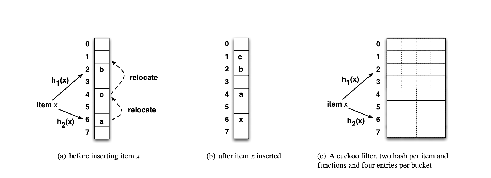

## Milestone Report

#### Summary
This project is more challenging than we expected, but the progress is going well. We should be able to complete all tasks mentioned in the 'Plan to Achieve' part of our project proposal. So far we have implemented the coarse-grained locked filter and most part of the fine-grained locked filter, and designed a feasible algorithm for the lock-free version. 

#### Tasks Completed

1. Developed a test & benchmark framework for the cuckoo filter project.
2. Implemented Coarse-grained locked filter.
3. Completed 80% of find-grained locked filter implementation (slightly delayed, will be finished in the next few days).
4. Designed a feasible algorithm that can make cuckoo filter lock-free.

#### Lock-free Algorithm Design

The most challenging part of our project is the implementation of the lock-free cuckoo filter, which is essentially harder to design than 1-array or 2-array cuckoo hash tables. Specifically, cuckoo filter uses 4-way associative bucketized cuckoo hash table, as illustrated in the below figure (this figure comes from paper [Cuckoo Filter: Practically Better Than Bloom](https://www.cs.cmu.edu/~dga/papers/cuckoo-conext2014.pdf)).

This structure complicates the replacement operation, because now  an item will have four possible new locations during replacement, instread of only one in 1-array or 2-array versions. Accordingly, the search path needed for finding a valid replacement location becomes a quad-tree rather than a line, making ensuring correctness significantly harder.

To address this challenge, we added a new rule for item replacement: an item $x$ placed at entry $N$ ($N \in  \{0, 1, 2, 3\}$, each bucket contains 4 entries) in bucket $h_1(x)$ can only be replaced to the same entry in bucket $h_2(x)$. In this way, we could make the bucketized cuckoo hash table lock-free using similar methods for 1-array or 2-array versions (paper [Lock-free Cuckoo Hashing](https://ieeexplore.ieee.org/document/6888938)).

Although this solution allows for a lock-free bucketized cuckoo hash table, it imposes restrictions on possible replacement locations, potentially adversely affecting the filter's utilization. In the upcoming weeks,, we will try to improve our lock-free design by employing a BFS-based replacement algorithm.

#### Additional Resources Used
In addition to the resources & references listed in the proposal, we also referenced the following libraries and papers:
1. OpenSSL library (`libssl-dev`), we use it for MD5 fingerprint generation.
2. `CycleTimer.h` from 15418's course resources, we use it to benchmark our code.
3. [MemC3: Compact and Concurrent MemCache with Dumber Caching and Smarter Hashing](https://www.usenix.org/system/files/conference/nsdi13/nsdi13-final197.pdf)
4. [Hazard pointers: safe memory reclamation for lock-free objects](https://ieeexplore.ieee.org/document/1291819) 